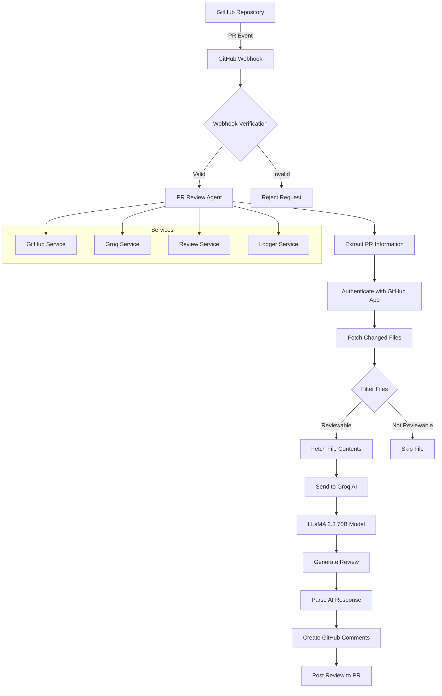
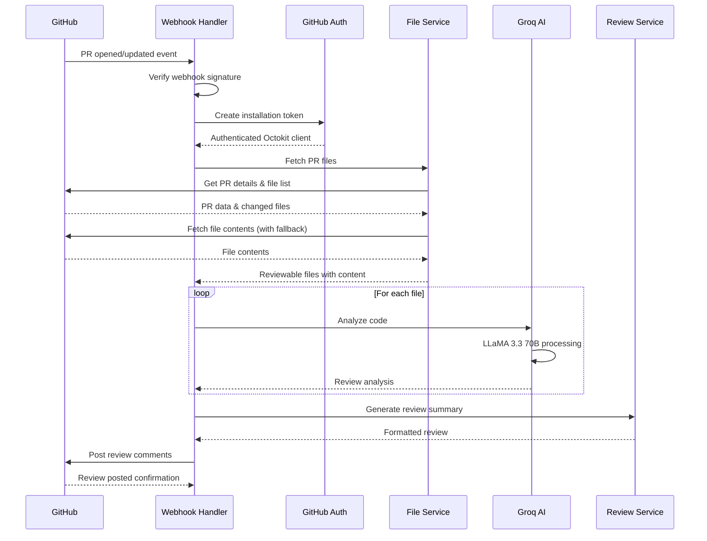
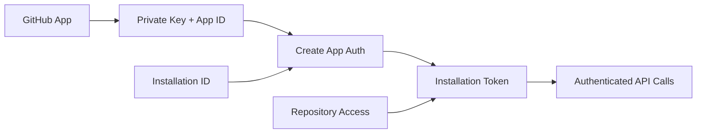
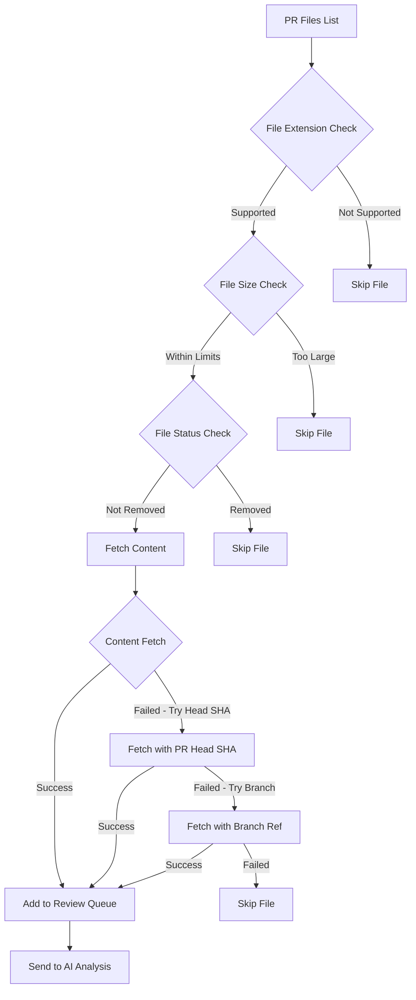

# GitHub PR Review Agent 🤖

An automated GitHub PR review agent powered by Groq AI that provides intelligent code reviews as soon as pull requests are created or updated. Built to work like CodeRabbit, but **free and self-hosted**.

[](https://github.com/kuldeep27396/pr-review-agent/actions/workflows/deploy.yml)
[](https://github.com/kuldeep27396/pr-review-agent/actions/workflows/test.yml)
[](https://opensource.org/licenses/MIT)
[](https://nodejs.org/)
[](https://railway.app/)

[](https://railway.app/new/template?template=https://github.com/kuldeep27396/pr-review-agent)


### 🛠️ Technology Stack
[](https://developer.mozilla.org/en-US/docs/Web/JavaScript)
[](https://nodejs.org/)
[](https://expressjs.com/)
[](https://www.docker.com/)
[](https://github.com/)
[](https://groq.com/)

### 📊 Project Stats
[](https://github.com/kuldeep27396/pr-review-agent)
[](https://github.com/kuldeep27396/pr-review-agent)
[](https://github.com/kuldeep27396/pr-review-agent)

## ✨ Features

- 🔄 **Automatic PR Reviews**: Reviews PRs immediately when opened or updated
- 🧠 **AI-Powered Analysis**: Uses Groq's fast LLaMA 3.3 70B model for intelligent code analysis
- 🎯 **Smart Filtering**: Only reviews relevant files and respects size limits
- 💬 **Contextual Comments**: Provides line-specific feedback with severity levels
- 🔒 **Security Focus**: Identifies potential security vulnerabilities
- ⚡ **Performance Insights**: Highlights performance concerns
- 🎨 **Code Quality**: Checks for best practices and code style
- 📊 **Comprehensive Reporting**: Generates overall PR summaries
- 🚀 **Easy Deployment**: One-click deploy to popular hosting platforms
- ⚙️ **Configurable**: Customizable review parameters and file limits
- 🔄 **Robust Error Handling**: Handles edge cases like force-pushes and invalid commits

## 🏗️ Architecture Overview



## 🔄 System Flow

### 1. Webhook Processing Flow



### 2. Authentication Flow



### 3. File Processing Pipeline



## 🚀 Quick Start

### Deploy on Railway (Recommended)

Deploy with one click on Railway for the best experience:

[](https://railway.app/new/template?template=https://github.com/kuldeep27396/pr-review-agent)

**Why Railway?**
- ⚡ **Auto-scaling** based on traffic
- 📊 **Persistent logs** and metrics
- 🔄 **Automatic deployments** from GitHub
- 💰 **Generous free tier** for testing
- 🛠️ **Built-in environment variable management**

### Manual Setup (Optional)

If you prefer to run locally or use a different platform:

1. **Clone the repository**
   ```bash
   git clone https://github.com/kuldeep27396/pr-review-agent.git
   cd pr-review-agent
   npm install
   ```

2. **Set up your GitHub App** (see [GitHub App Setup](#github-app-setup))

3. **Configure environment variables** (see [Configuration](#-configuration))

4. **Start the application**
   ```bash
   npm start
   ```

## 📋 Prerequisites

### GitHub App Setup

1. **Create a GitHub App** at [GitHub Apps](https://github.com/settings/apps/new):
   - **App name**: `Your PR Review Agent`
   - **Homepage URL**: Your deployment URL
   - **Webhook URL**: `https://your-domain.com/webhook`
   - **Webhook secret**: Generate a secure random string

2. **Set Repository Permissions**:
   ```
   Contents: Read
   Pull requests: Write  
   Metadata: Read
   ```

3. **Subscribe to Events**:
   ```
   Pull request
   Pull request review
   ```

4. **Download the private key** and note your App ID

5. **Install the app** on your repositories

### Groq API Key

1. Sign up at [Groq Console](https://console.groq.com/)
2. Create an API key (free tier available)
3. Note the key for configuration

## ⚙️ Configuration

### Environment Variables

Create a `.env` file or set environment variables:

```env
# GitHub App Configuration (Required)
GITHUB_APP_ID=1234567                    # Your GitHub App ID
GITHUB_PRIVATE_KEY="-----BEGIN RSA..."  # Your private key (with proper newlines)
GITHUB_WEBHOOK_SECRET=your_secret_here   # Webhook secret for verification

# Groq API Configuration (Required)
GROQ_API_KEY=gsk_...                     # Your Groq API key

# Server Configuration
PORT=3000                                # Server port (default: 3000)
NODE_ENV=production                      # Environment mode

# Review Settings (Optional)
MAX_FILES_TO_REVIEW=10                   # Max files per PR (default: 10)
MAX_FILE_SIZE_KB=100                     # Max file size in KB (default: 100)
REVIEW_TIMEOUT_MS=30000                  # AI request timeout (default: 30s)
LOG_LEVEL=info                           # Logging level (error/warn/info/debug)
```

### Supported File Types

The agent reviews these file types:

| Category | Extensions |
|----------|------------|
| **JavaScript/TypeScript** | `.js`, `.jsx`, `.ts`, `.tsx`, `.vue`, `.svelte` |
| **Python** | `.py` |
| **Java/JVM** | `.java`, `.kt`, `.scala` |
| **C/C++** | `.c`, `.cpp`, `.h` |
| **Systems** | `.rs`, `.go`, `.cs` |
| **Mobile** | `.swift`, `.dart` |
| **Web** | `.html`, `.css`, `.scss`, `.less` |
| **Data** | `.sql`, `.r`, `.yaml`, `.yml`, `.json`, `.xml` |
| **Scripts** | `.sh`, `.php`, `.rb` |

## 📖 How It Works

### Core Workflow

1. **🎣 Webhook Reception**: GitHub sends PR events to `/webhook` endpoint
2. **🔐 Authentication Verification**: Validates webhook signature and creates GitHub App token
3. **📁 File Discovery**: Fetches list of changed files from PR
4. **🔍 Smart Filtering**: Filters files by type, size, and status (excludes removed files)
5. **📄 Content Retrieval**: Fetches file contents with robust error handling:
   - Primary: Use individual file SHA
   - Fallback 1: Use PR head SHA (handles force-pushes)
   - Fallback 2: Use PR branch reference
6. **🤖 AI Analysis**: Sends code to Groq's LLaMA 3.3 70B model with structured prompts
7. **📝 Review Generation**: Parses AI response and creates structured comments
8. **💬 Comment Posting**: Posts line-specific comments and overall review to PR

### Review Categories & Severity

| Category | Icon | Description | Triggers |
|----------|------|-------------|----------|
| **Bugs** | 🐛 | Potential runtime errors | `REQUEST_CHANGES` |
| **Security** | 🔒 | Security vulnerabilities | `REQUEST_CHANGES` |
| **Performance** | ⚡ | Performance bottlenecks | `COMMENT` |
| **Style** | 🎨 | Code style issues | `COMMENT` |
| **Best Practices** | ✅ | Code quality improvements | `COMMENT` |

| Severity | Icon | Action |
|----------|------|--------|
| **High** | 🔴 | Request changes |
| **Medium** | 🟡 | Add comment |
| **Low** | 🟢 | Add comment |

### AI Prompt Structure

The agent uses carefully crafted prompts that include:

- **Context**: PR title, description, and file metadata
- **Code Content**: Full file content with syntax highlighting
- **Analysis Requirements**: 
  - Overall assessment (APPROVE/REQUEST_CHANGES/COMMENT)
  - Specific issues with line numbers
  - Security concerns
  - Performance considerations
  - Improvement suggestions
- **Response Format**: Structured JSON for consistent parsing

## 🔧 Development

### Local Development

```bash
# Install dependencies
npm install

# Start development server with auto-reload
npm run dev

# Run tests
npm test

# Test server functionality
npm run test-server

# Validate environment configuration
npm run validate
```


### Project Structure

```
github-pr-review-agent/
├── src/
│   ├── index.js                 # Main application & webhook handler
│   ├── services/
│   │   ├── github.js           # GitHub API integration & authentication
│   │   ├── groq.js             # Groq AI service & prompt management  
│   │   └── review.js           # Review orchestration & comment generation
│   └── utils/
│       └── logger.js           # Logging utility with file/console output
├── scripts/
│   ├── setup-github-app.js     # GitHub App setup helper
│   ├── validate-env.js         # Environment validation
│   └── test-github-auth.js     # Authentication testing
├── test/
│   └── test-server.js          # Local testing utilities
├── docs/                       # Deployment guides
├── .github/workflows/          # CI/CD workflows
├── Dockerfile                  # Container configuration
├── docker-compose.yml          # Local development setup
├── railway.json               # Railway deployment config
└── render.yaml                # Render deployment config (legacy)
```

### Testing

```bash
# Test GitHub authentication locally
node scripts/test-github-auth.js

# Test Groq API connection
node -e "
const { GroqService } = require('./src/services/groq');
new GroqService().analyzeCode({filename: 'test.js', content: 'console.log(\"test\")'})
  .then(result => console.log('✅ Groq test passed'))
  .catch(err => console.error('❌ Groq test failed:', err));
"

# Validate all environment variables
npm run validate
```

## 📚 API Endpoints

| Endpoint | Method | Description | Response |
|----------|--------|-------------|----------|
| `/` | GET | Application info and status | JSON with app info |
| `/health` | GET | Health check for monitoring | `200` (healthy) / `500` (unhealthy) |
| `/webhook` | POST | GitHub webhook handler | `200` (processed) / `400` (invalid) |

### Health Check Response

```json
{
  "status": "healthy",
  "timestamp": "2025-01-26T10:30:00.000Z",
  "uptime": 3600,
  "version": "1.0.0"
}
```

## 🔍 Monitoring & Debugging

### Comprehensive Logging

The application provides detailed logging at multiple levels:

```typescript
// Log levels and what they capture
ERROR: Authentication failures, API errors, critical issues
WARN:  File fetch failures, parsing issues, non-critical problems  
INFO:  PR processing, successful operations, status updates
DEBUG: Detailed execution flow, variable values, timing info
```

### Log Output Locations

- **Console**: All log levels (formatted for readability)
- **File System**: Organized log files (when writable)
  - `logs/error.log` - Error messages only
  - `logs/warn.log` - Warning level and above
  - `logs/info.log` - Info level and above  
  - `logs/all.log` - All log messages
- **Container Environments**: Graceful fallback to console-only logging

### Debugging Workflow

1. **Check Health Endpoint**: `GET /health` to verify service status
2. **Review Recent Logs**: Check application logs for error patterns
3. **Test Authentication**: Run `node scripts/test-github-auth.js` for GitHub issues
4. **Validate Configuration**: Run `npm run validate` for environment issues
5. **Monitor Webhooks**: Check GitHub App's "Advanced" tab for delivery status

### Common Debug Scenarios

**No reviews being posted?**
- Check webhook deliveries in GitHub App settings
- Verify app installation on target repositories
- Confirm webhook URL is publicly accessible
- Review authentication logs for token issues

**Reviews failing for specific files?**
- Check file size limits (`MAX_FILE_SIZE_KB`)
- Verify file extensions are supported
- Look for content fetch errors in logs
- Test with simpler files first

**AI analysis errors?**
- Verify Groq API key and quota
- Check for rate limiting in logs  
- Test with smaller code snippets
- Monitor API response times

## 🚀 Railway Deployment Guide

### Step-by-Step Railway Setup

1. **Click Deploy Button**
   [](https://railway.app/new/template?template=https://github.com/kuldeep27396/pr-review-agent)

2. **Connect Your GitHub Account**
   - Railway will fork the repository to your account
   - Automatic deployments will be set up

3. **Configure Environment Variables**
   In the Railway dashboard, add these variables:
   ```env
   GITHUB_APP_ID=your_app_id
   GITHUB_PRIVATE_KEY=your_private_key
   GITHUB_WEBHOOK_SECRET=your_webhook_secret
   GROQ_API_KEY=your_groq_api_key
   ```

4. **Get Your Webhook URL**
   - After deployment, Railway provides a URL like: `https://your-app.railway.app`
   - Your webhook URL will be: `https://your-app.railway.app/webhook`

5. **Update GitHub App Settings**
   - Go to your GitHub App settings
   - Update webhook URL to your Railway deployment URL

### Railway Features

- **🔄 Automatic Deployments**: Every push to main branch triggers a new deployment
- **📊 Built-in Monitoring**: View logs, metrics, and resource usage
- **⚡ Auto-scaling**: Automatically scales based on traffic
- **💰 Free Tier**: Generous free tier for personal projects
- **🛠️ Easy Management**: Simple dashboard for environment variables and settings

### Alternative Deployment (Docker)

If you prefer Docker deployment on any other platform:

```bash
# Build the container
docker build -t pr-review-agent .

# Run with environment variables
docker run -d \
  -p 3000:3000 \
  -e GITHUB_APP_ID=your_app_id \
  -e GITHUB_PRIVATE_KEY="$(cat private-key.pem)" \
  -e GITHUB_WEBHOOK_SECRET=your_secret \
  -e GROQ_API_KEY=your_groq_key \
  pr-review-agent
```

**Note**: Railway is the recommended and tested deployment platform for this project.

## 🤝 Contributing

We welcome contributions! Here's how to get started:

### Development Setup

1. **Fork and Clone**
   ```bash
   git clone https://github.com/your-username/pr-review-agent.git
   cd pr-review-agent
   npm install
   ```

2. **Set Up Environment**
   ```bash
   cp .env.example .env
   # Fill in your configuration values
   ```

3. **Run Tests**
   ```bash
   npm test
   npm run validate
   ```

### Contribution Guidelines

- **Code Style**: Follow existing patterns and use meaningful variable names
- **Logging**: Add appropriate log statements for debugging
- **Error Handling**: Include comprehensive error handling for external APIs
- **Documentation**: Update README and code comments for new features
- **Testing**: Test with real GitHub repositories and various file types

### Pull Request Process

1. Create a feature branch (`git checkout -b feature/amazing-feature`)
2. Make your changes with appropriate tests
3. Ensure all tests pass and linting is clean
4. Update documentation for any new features
5. Commit with clear, descriptive messages
6. Push to your branch and create a Pull Request

## 🐛 Troubleshooting

### Authentication Issues

**Problem**: `[@octokit/auth-token] Token passed to createTokenAuth is not a string`
**Solution**: Ensure you're using `authStrategy: createAppAuth` in Octokit configuration

**Problem**: `Bad credentials` errors
**Solution**: 
- Verify GitHub App ID is correct (numeric)
- Check private key format includes proper line breaks
- Confirm app is installed on target repositories

**Problem**: `Installation not found`
**Solution**: Install the GitHub App on your repositories through the GitHub interface

### File Processing Issues  

**Problem**: `No commit found for the ref` errors
**Solution**: The agent now handles this automatically with fallback strategies

**Problem**: No files being reviewed despite PR having changes
**Solution**: 
- Check if files have supported extensions
- Verify files aren't exceeding size limits
- Check file status (removed files are skipped)

### API Issues

**Problem**: Groq API timeout or rate limit errors
**Solution**:
- Increase `REVIEW_TIMEOUT_MS` for larger files
- Check Groq API quota and usage
- Consider upgrading Groq plan for higher limits

**Problem**: Webhook signature verification failures
**Solution**:
- Verify `GITHUB_WEBHOOK_SECRET` matches GitHub App configuration
- Check webhook URL is correct and accessible
- Ensure raw body is used for signature verification

### Performance Issues

**Problem**: Reviews taking too long
**Solution**:
- Reduce `MAX_FILES_TO_REVIEW` limit
- Decrease `MAX_FILE_SIZE_KB` limit  
- Check network connectivity to APIs

**Problem**: Memory issues with large files
**Solution**:
- Lower file size limits
- Implement streaming for large file processing
- Monitor container memory usage

## 📄 License

This project is licensed under the MIT License - see the [LICENSE](LICENSE) file for details.

## 🙏 Acknowledgments

- **[Groq](https://groq.com/)** - For providing fast AI inference with LLaMA models
- **[Octokit](https://octokit.github.io/)** - For excellent GitHub API integration
- **[CodeRabbit](https://coderabbit.ai/)** - For inspiration and reference
- **Open Source Community** - For tools, libraries, and continuous improvement

## 🌟 Star History

If you find this project useful, please consider giving it a star! ⭐

## 🔗 Related Projects

- [CodeRabbit](https://coderabbit.ai/) - Commercial AI code review service
- [GitHub Copilot](https://github.com/features/copilot) - AI-powered coding assistant
- [SonarQube](https://www.sonarqube.org/) - Code quality and security analysis
- [ReviewBot](https://www.reviewbot.io/) - Automated code review tools

---

**Made with ❤️ for the developer community**

*Deploy your own instance today and experience AI-powered code reviews!*
